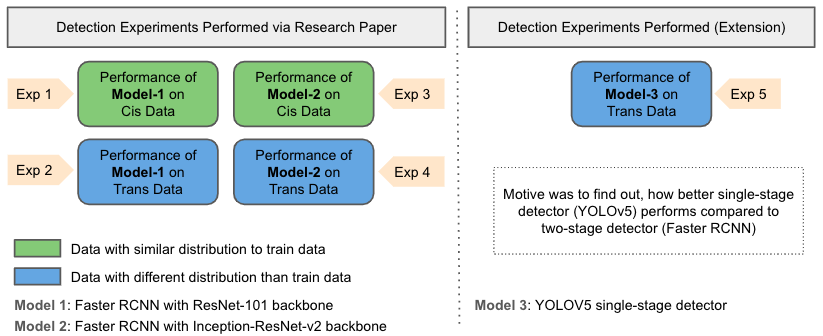
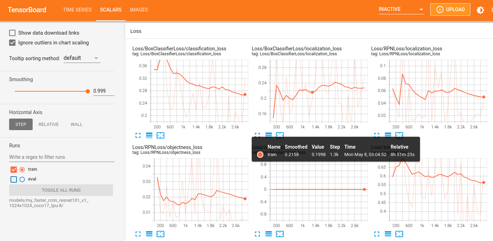
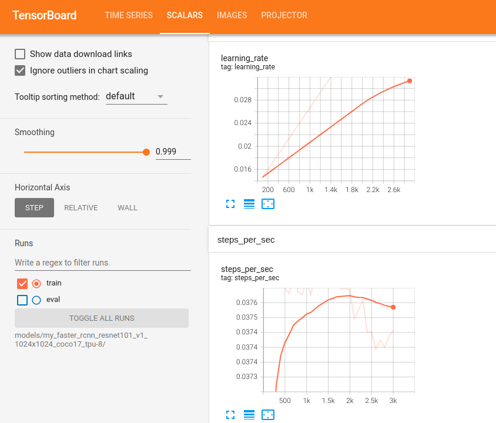
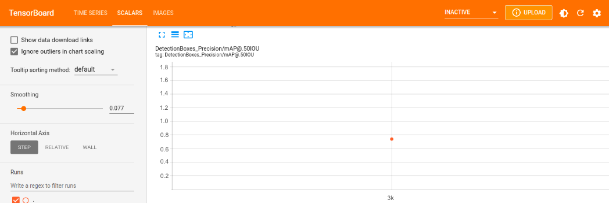

# recognition_in_terra_incognita

## Detection Experiments Performed


### Experiment 1:
- Model: Faster RCNN with ResNet-101 backbone
- Data distribution:
    - **Train**: train_annotations
    - **Val**: cis_val_annotations
    - **Test**: cis_test_annotations
- Motive of experiment: To see, how well the model performs on similar data distribution

- Root folder:   `exp_1_detect_cis_val_resnet-101`

#### Store Images:
- All the images of train, val and test distribution that we will use to train and evaluate this model are stored in the `images`folder of root directory.

#### Create Label Map:
- TensorFlow requires a label map, which namely maps each of the used labels to an integer values. This label map is used both by the training and detection processes.
- The label map for our 15 classes can be found in `./annotations/label_map.pbtxt` of root directory.

#### Create TensorFlow Records:
- Now, we need to convert our annotations into the TFRecord format.
- To convert training images to TFRecord:
    ```
    python generate_tfrecord.py -x ./images/train_annotations -l ./annotations/label_map.pbtxt -o ./annotations/train_annotations.record
    ```
- To convert validation images to TFRecord:
    ```
    python generate_tfrecord.py -x ./images/cis_val_annotations -l ./annotations/label_map.pbtxt -o ./annotations/cis_val_annotations.record
    ```    

#### Training the Model
- To initiate a new training run the following command in the root directory
    ```
    python model_main_tf2.py --model_dir=./models/my_faster_rcnn_resnet101_v1_1024x1024_coco17_tpu-8 --pipeline_config_path=models/my_faster_rcnn_resnet101_v1_1024x1024_coco17_tpu-8/pipeline.config
    ```

- After the model has been trained, all its snapshots will be stored in the folder `./models/my_faster_rcnn_resnet101_v1_1024x1024_coco17_tpu-8`

- Model training process logs can be visualized via `tensorboard` via this command:
    ```
    tensorboard --logdir=models/my_faster_rcnn_resnet101_v1_1024x1024_coco17_tpu-8
    ```

#### Training Log Result
- Once, we run the tensorboard command, we can visualize the training logs at local host: `http://localhost:6006/`
- Here is the screenshot of all kinds of loss calculated till 3000 iterations:
    
<br />

- Here is the learning rate and steps-per-sec logs throughout all iterations: <br />
    
<br />

#### Export Model
- After the model training is completed, expoort the model via the command:
    ```
    python exporter_main_v2.py --input_type image_tensor --pipeline_config_path ./models/my_faster_rcnn_resnet101_v1_1024x1024_coco17_tpu-8/pipeline.config --trained_checkpoint_dir ./models/my_faster_rcnn_resnet101_v1_1024x1024_coco17_tpu-8/ --output_directory ./exported-models/my_model
    ```

#### Evaluating the Model
- After the model has been trained, we would like to evaluate the model performance via standard evaluation metrics of object detection like mAP. To  evaluate  trained model performance, run the following command:
    ```
    python model_main_tf2.py --model_dir=./models/my_faster_rcnn_resnet101_v1_1024x1024_coco17_tpu-8 --pipeline_config_path=./models/my_faster_rcnn_resnet101_v1_1024x1024_coco17_tpu-8/pipeline.config --checkpoint_dir=./models/my_faster_rcnn_resnet101_v1_1024x1024_coco17_tpu-8
    ```
- Once the above command runs successfully, we will see a new folder `eval` inside the directory `./models/my_faster_rcnn_resnet101_v1_1024x1024_coco17_tpu-8`. This new folder has the evaluation snapshot of the trained model that can be visualized via the following tensorboard command:
    ```
    tensorboard --logdir=models/my_faster_rcnn_resnet101_v1_1024x1024_coco17_tpu-8/eval/events.out.tfevents.1683552233.gnode022.21884.0.v2
    ```
#### Evaluation Log Result
- Here is the screenshot of the model evaluation i.e., mAP@0.5IOU:
    
<br />
The orange dot indicates the mAP value at 3000 iterations i.e., above 70%

## Resources
- https://tensorflow-object-detection-api-tutorial.readthedocs.io/en/latest/training.html#