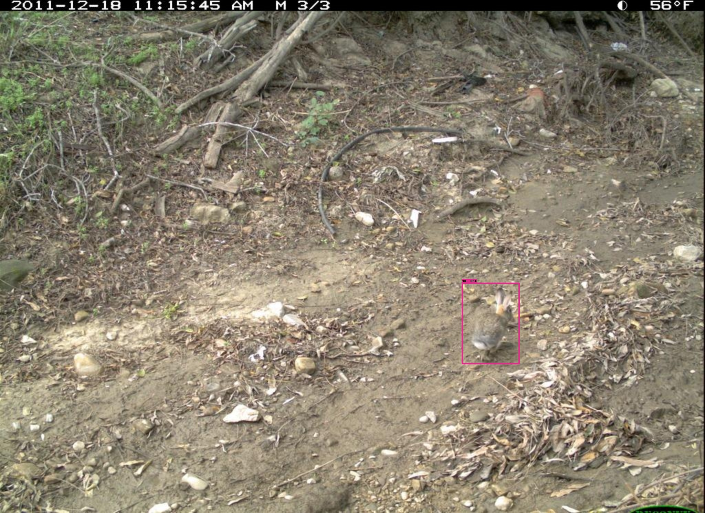
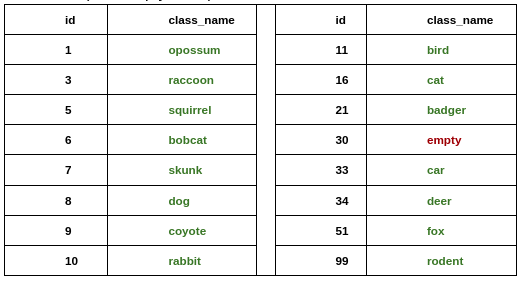
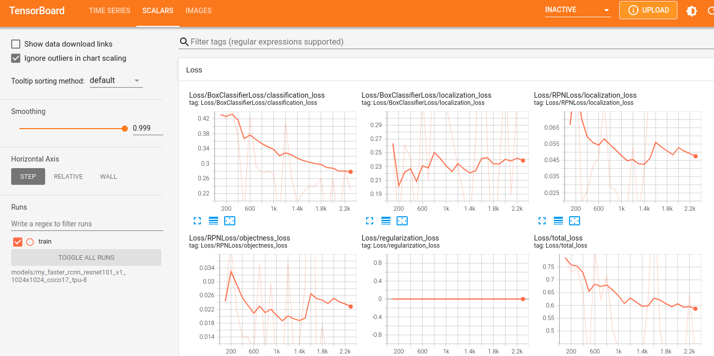
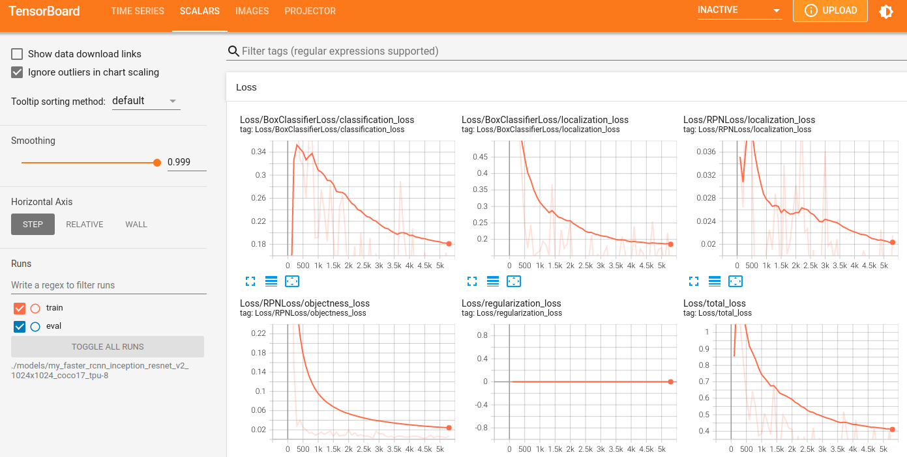
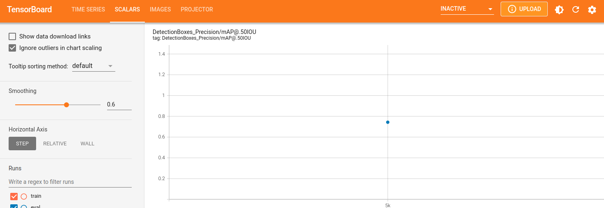
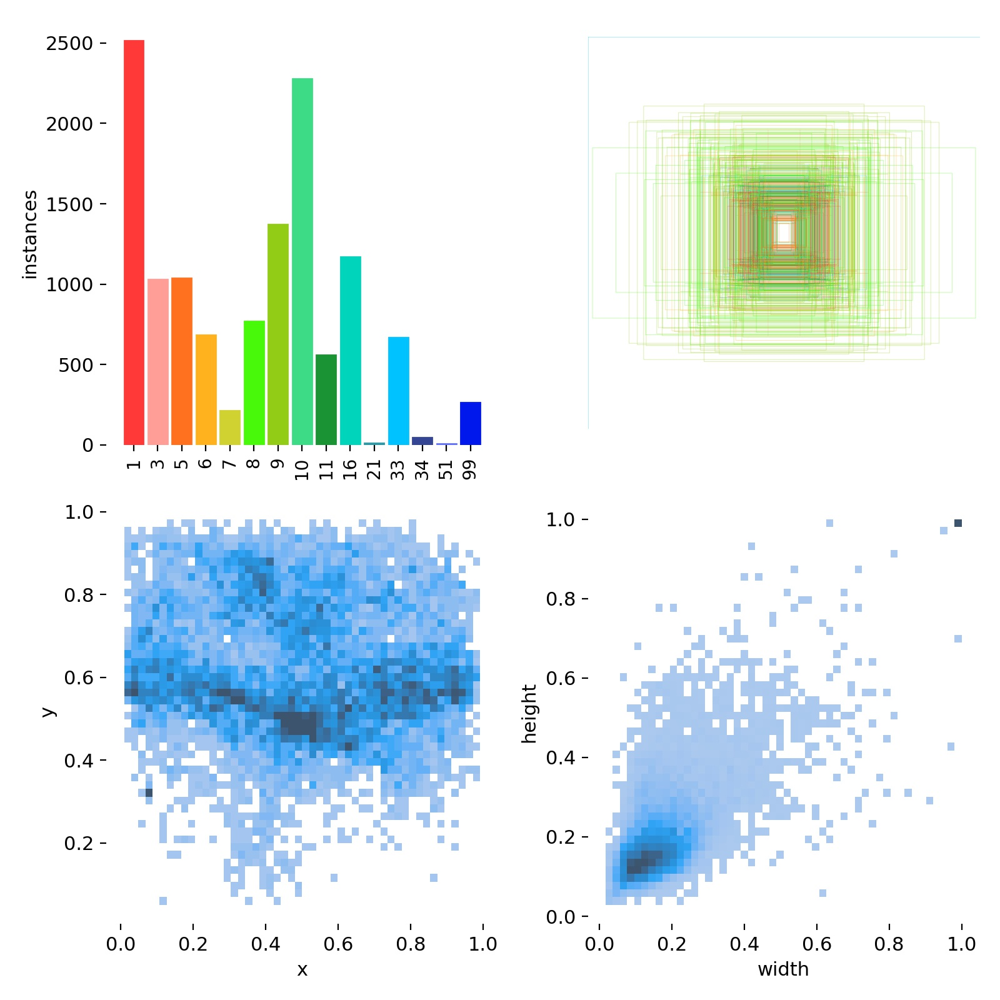
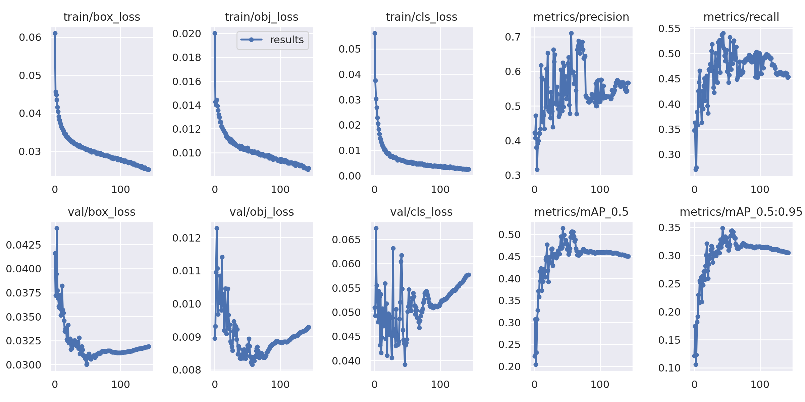
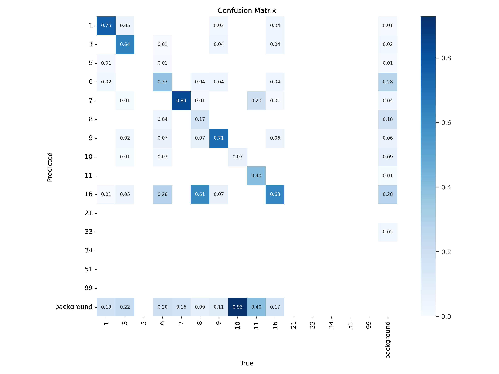
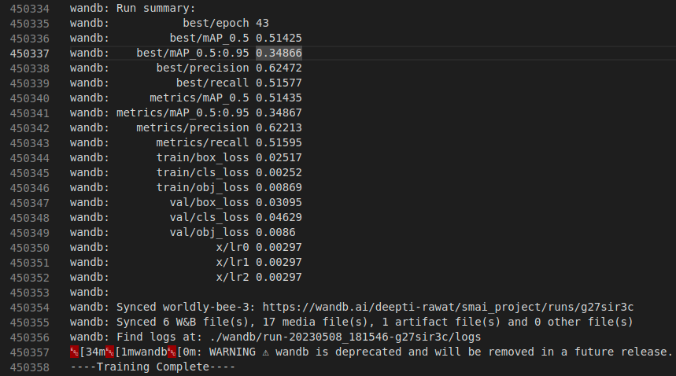

# recognition_in_terra_incognita

## Detection Experiments Performed


### Experiment 1:
- Model: Faster RCNN with ResNet-101 backbone
- Data distribution:
    - **Train**: train_annotations
    - **Val**: cis_val_annotations
    - **Test**: cis_test_annotations
- Motive of experiment: To see, how well the model performs on similar data distribution

- Root folder:   `exp_1_detect_cis_val_resnet-101`

#### Store Images:
- All the images of train, val and test distribution that we will use to train and evaluate this model are stored in the `images` folder of root directory.

#### Create Label Map:
- TensorFlow requires a label map, which maps each of the used labels to an integer values. This label map is used both by the training and detection processes.
- The label map for our 15 classes can be found in `./annotations/label_map.pbtxt` of root directory.

#### Create TensorFlow Records:
- Now, we need to convert our annotations into the TFRecord format.
- To convert training images to TFRecord:
    ```
    python generate_tfrecord.py -x ./images/train_annotations -l ./annotations/label_map.pbtxt -o ./annotations/train_annotations.record
    ```
- To convert validation images to TFRecord:
    ```
    python generate_tfrecord.py -x ./images/cis_val_annotations -l ./annotations/label_map.pbtxt -o ./annotations/cis_val_annotations.record
    ```    

#### Training the Model
- To initiate a new training, run the following command in the root directory
    ```
    python model_main_tf2.py --model_dir=./models/my_faster_rcnn_resnet101_v1_1024x1024_coco17_tpu-8 --pipeline_config_path=models/my_faster_rcnn_resnet101_v1_1024x1024_coco17_tpu-8/pipeline.config
    ```

- After the model has been trained, all its snapshots will be stored in the folder `./models/my_faster_rcnn_resnet101_v1_1024x1024_coco17_tpu-8`

- Model training process logs can be visualized via `tensorboard` via this command:
    ```
    tensorboard --logdir=models/my_faster_rcnn_resnet101_v1_1024x1024_coco17_tpu-8
    ```
- All training logs can be found in file present in root directory:
    `logFile_exp_1_detect_cis_val_resnet-101.txt`

#### Training Log Result
- Once, we run the tensorboard command, we can visualize the training logs at local host: `http://localhost:6006/`
- Here is the screenshot of all kinds of loss calculated till 3000 iterations:
    
<br />
- Here is the learning rate and steps-per-sec logs throughout all iterations: <br />
    
<br />

#### Export Model
- After the model training is completed, expoort the model via the command:
    ```
    python exporter_main_v2.py --input_type image_tensor --pipeline_config_path ./models/my_faster_rcnn_resnet101_v1_1024x1024_coco17_tpu-8/pipeline.config --trained_checkpoint_dir ./models/my_faster_rcnn_resnet101_v1_1024x1024_coco17_tpu-8/ --output_directory ./exported-models/my_model
    ```

#### Evaluating the Model
- After the model has been trained, we would like to evaluate the model performance via standard evaluation metrics of object detection like mAP. To  evaluate  trained model performance, run the following command:
    ```
    python model_main_tf2.py --model_dir=./models/my_faster_rcnn_resnet101_v1_1024x1024_coco17_tpu-8 --pipeline_config_path=./models/my_faster_rcnn_resnet101_v1_1024x1024_coco17_tpu-8/pipeline.config --checkpoint_dir=./models/my_faster_rcnn_resnet101_v1_1024x1024_coco17_tpu-8
    ```
- Once the above command runs successfully, we will see a new folder `eval` inside the directory `./models/my_faster_rcnn_resnet101_v1_1024x1024_coco17_tpu-8`. This new folder has the evaluation snapshot of the trained model that can be visualized via the following tensorboard command:
    ```
    tensorboard --logdir=models/my_faster_rcnn_resnet101_v1_1024x1024_coco17_tpu-8/eval/events.out.tfevents.1683552233.gnode022.21884.0.v2
    ```

#### Evaluation Log Result
- Here is the screenshot of the model evaluation i.e., mAP@0.5IOU:
    
- The orange dot indicates the mAP value at 3000 iterations i.e., above 70%

#### Inference
- To run inference on a desired image from test set. Choose an image from the folder `cis_test_annotations` and run the following command:
    ```
    python3 infer.py
    ```
- If the above command  executes successfully, an image will be saved in the root directory with corresponding detection bounding box.
    

- Verify whether the class of the animal is correctly detected by using the following mapping: <br />
    

- In our case, the animal is correctly predicted as class 10, i.e., Rabbit.
<br />

## Resources
- https://tensorflow-object-detection-api-tutorial.readthedocs.io/en/latest/training.html#

### Experiment 2:
- Model: Faster RCNN with ResNet-101 backbone
- Data distribution:
    - **Train**: train_annotations
    - **Val**: trans_val_annotations
    - **Test**: trans_test_annotations
- Motive of experiment: To see, how well the model performs on a different data distribution

- Root folder:`exp_2_detect_trans_val_resnet-101`

- All the steps of training and evaluation are similar to Experiment 1. The only difference is the dataset chosen for training.

- #### Training Log Result
- Once, we run the tensorboard command, we can visualize the training logs at local host: `http://localhost:6006/`
- Here is the screenshot of all kinds of loss calculated till 2000+ iterations:
    
<br />

### Experiment 3:
- Model: Faster RCNN with Inception-ResNet-v2 backbone
- Data distribution:
    - **Train**: train_annotations
    - **Val**: cis_val_annotations
    - **Test**: cis_test_annotations
- Motive of experiment: To see, how well the model performs on similar data distribution

- Root folder:   `exp_3_detect_cis_val_inception_resnet-v2`

- All the steps of training and evaluation are similar to Experiment 1. The only difference is the model chosen for training.

- #### Training Log Result
- Once, we run the tensorboard command, we can visualize the training logs at local host: `http://localhost:6006/`
- Here is the screenshot of all kinds of loss calculated till 5000 iterations:
    
<br />

#### Evaluation Log Result
- Here is the screenshot of the model evaluation i.e., mAP@0.5IOU:
    
- The blue dot indicates the mAP value at 5000 iterations i.e., above 70%

### Experiment 5:
- Model: YOLOv5 (small - 14 MB)
- Data distribution:
    - **Train**: train_annotations
    - **Val**: trans_val_annotations
    - **Test**: trans_test_annotations
- Motive of experiment: YOLOv5 is a SOTa one-stage detector. This experiment is conducted solely to determine, how well it performs with respect to the two-stage detector>

- Root folder:   `./exp_5_yolov5/yolov5_baseline`

#### Create yaml file:
- This file contains the path of the dataset used during training and all class names.
- The yaml file for our 15 classes can be found in `./data/custom15.yaml` of root directory.

#### Create Datset:
- The training dataset needs to follow a certain directory structure. It should have a folder called `images` and corresponding folder called `lables`. The images have all the images and labels have all the text file corresponding to each image which has normalized bounding box coordinates for each class found in that image.

#### Training the Model
- For training, we are going to use transfer learning on the pre-traing yolov5s model. The pre-trained model will be automatically downloaded in this root directory as we write the training command. THe pre-trained model is stored in the drive link below, namely `yolov5s.pt`:
    ```
    Link: https://iiitaphyd-my.sharepoint.com/:f:/g/personal/deepti_rawat_research_iiit_ac_in/EiAKxomIZgpFjijFVMTSooMBvNJ_y3bAr63YUew0mX5gnA?e=rfhP1t
    ```

- To initiate a new training run the following command in the root directory:
    ```
    python3 train.py --img 640 --batch 8 --epochs 200 --data ./data/custom15.yaml --weights yolov5s.pt
    ```

- All the training logs can be found in `logFile_yolov5.txt` in the root directory.

- After the model has been trained, the final trained model is stored in the folder `./runs/train/exp/weights`. Also, the model snapshots and training and evaluation metrics like losses, data distribution, confusion metrics, F1 score, are stored in `./runs/train/exp/`

#### Training Log Result
- The data distribution can be visualized as follows: <br />
    
<br />
- Here is, all kinds of loss calculated for 200 epochs: <br />
    
<br />
- Here is the confusion matrix: <br />
    
<br />
- Once the training completes, the overall metrics is also printed at the end of the `logFile_yolov5.txt`. Here is the screenshot for that: <br />
    
<br />
- For a thorough report of training and validation metrics, please visit this [wandB Report](https://api.wandb.ai/links/deepti-rawat/ou2xnpqj)

## Resources
- https://github.com/ultralytics/yolov5 